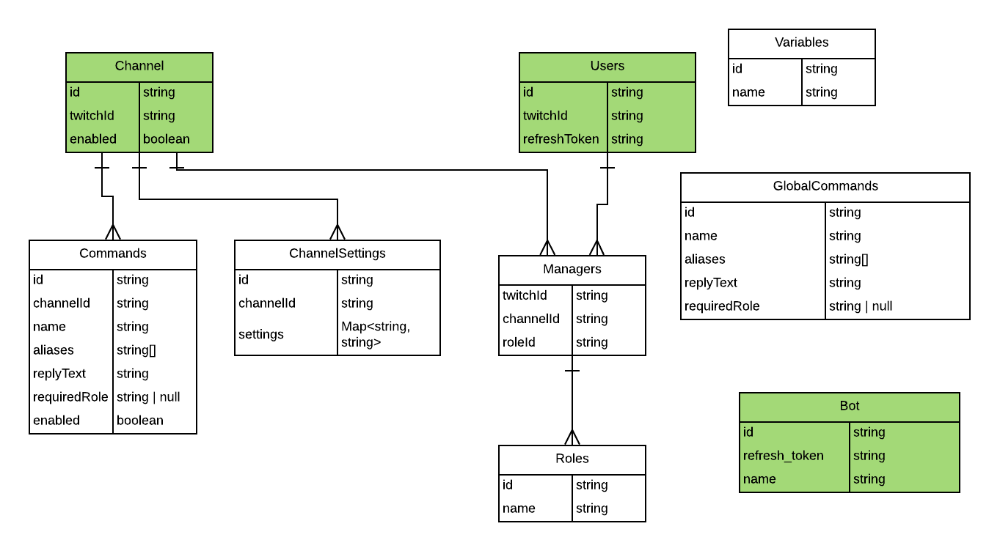

# Twitch Bot

A general purpose twitch bot that will work with multiple channels.

## TODO

* [x] Model the data
* [x] Setup Backend
* [x] Install tmi.js
* [x] Twitch Oauth
* [x] Add the bot to a channel
* [x] Bot can read and respond to messages in specified channels

## Environment Variable Names

- PORT - HTTP port for the Express server.
- TWITCH_CLIENT_ID - Client ID for the Twitch app
- TWITCH_CLIENT_SECRET - Client OAuth Secret for the Twitch app
- TWITCH_CLIENT_REDIR_HOST - Base host for the OAuth redirect URL.
	(`/auth/twitch/callback`)

http://localhost:8888/auth/twitch?scope=moderation:read

## Data Model

* Work in progress.
* Green entities are completed.

